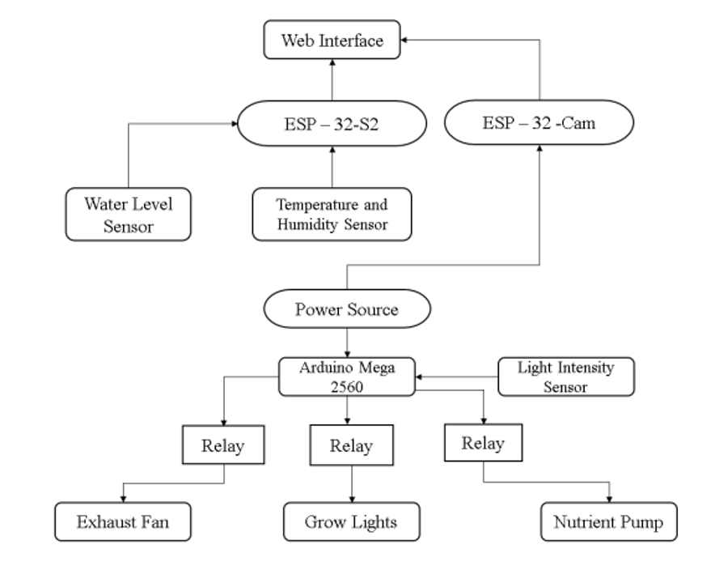
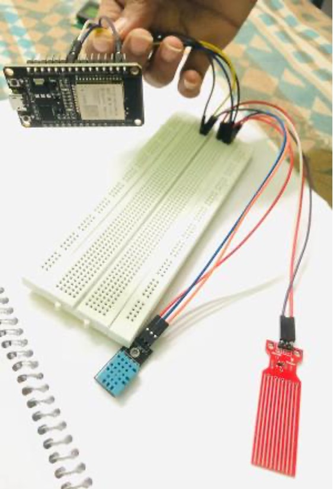
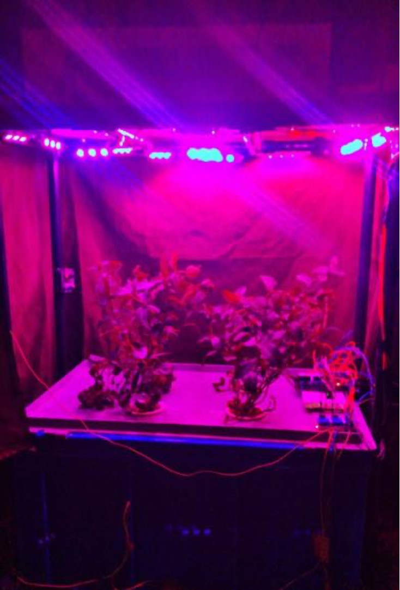

# Smart Aeroponic System - IoT Based Agriculture Solution

## 📋 Project Overview
An IoT-enabled smart aeroponic system designed to optimize soilless plant cultivation through automated monitoring and control of environmental parameters. This project demonstrates the integration of sensor networks, microcontroller systems, and web technologies to create an efficient agricultural solution that uses 90% less water than traditional farming methods.

## 🎯 Key Features
- **Real-time Environmental Monitoring**: Temperature, humidity, light intensity, water level, and CO2 monitoring
- **Automated Control System**: Smart control of LED grow lights, nutrient pumps, and exhaust fans
- **Remote Monitoring**: Web server interface accessible via ESP32-S2 for real-time data visualization
- **Visual Documentation**: ESP32-CAM integration for plant growth monitoring
- **Water Efficient**: Uses up to 90% less water compared to traditional soil-based agriculture
- **Optimized Growth Conditions**: Maintains optimal parameters for accelerated plant growth

## 🛠️ Hardware Components

### Core Controllers
- **Arduino Mega 2560**: Main microcontroller for sensor data processing and actuator control
- **ESP32-S2**: WiFi-enabled module for web server and remote monitoring
- **ESP32-CAM**: Camera module for visual plant growth documentation

### Sensors
- **DHT11**: Temperature and humidity sensor
- **Water Level Sensor**: Monitors nutrient solution levels
- **LDR (LM393)**: Light intensity detection
- **CO2 Sensor**: Monitors carbon dioxide levels in growth chamber

### Actuators
- **DC Water Pump**: Automated nutrient solution delivery
- **LED Grow Lights**: Full-spectrum lighting for optimal photosynthesis
- **Exhaust Fan**: Climate control and ventilation
- **Relay Modules**: Control interface for high-power components

## 💻 Software Requirements
- Arduino IDE (v1.8.x or higher)
- ESP32 Board Support Package
- Required Libraries:
 - DHT sensor library
 - ESP32 WebServer library
 - WiFi library
## 📸 Project Images

### System Architecture

*System flowchart showing data flow and control logic*

### Hardware Components

*Various sensors used in the aeroponic system*

### System Prototype

*Complete aeroponic system prototype with grow chamber*
## 🚀 Getting Started

### Prerequisites
1. Install Arduino IDE from [official website](https://www.arduino.cc/en/software)
2. Add ESP32 board support through Board Manager
3. Install required libraries through Library Manager

### Hardware Setup
1. Connect sensors to Arduino Mega according to pin configuration
2. Wire relay modules for pump and light control
3. Set up ESP32-S2 for WiFi connectivity
4. Position ESP32-CAM for optimal plant viewing angle
5. Ensure proper power supply connections (12V for pump, 5V for controllers)

## 🌱 Results & Performance

### Comparative Analysis (50-day growth period)
- **Growth Rate**: 30-40% faster than soil-based cultivation
- **Water Usage**: 90% reduction compared to traditional methods
- **Yield**: Higher density crops with improved quality
- **Disease Resistance**: Minimal pest and disease issues in controlled environment

### Test Crop: Mint (Mentha)
- Healthier leaf development
- Longer, disease-free leaves
- Enhanced aromatic properties
- Consistent growth patterns

## 📈 System Parameters

| Parameter | Optimal Range | Control Method |
|-----------|--------------|----------------|
| Temperature | 15°C - 25°C | DHT11 + Ventilation |
| Humidity | 60% - 80% | Misting intervals |
| pH | 5.5 - 6.5 | Manual monitoring |
| Light Cycle | 16h light / 8h dark | Timer + LDR |
| Nutrient Misting | 30s every 24 min | Automated pump |

## 🔄 Future Enhancements
- AI/ML integration for predictive growth optimization
- Advanced pH and EC sensors for nutrient monitoring
- Solar power integration for sustainable operation
- Mobile app development for enhanced user interface
- Multi-chamber support for different crop varieties
- Blockchain integration for crop traceability

## 📚 Documentation
- [Project Report](./docs/Project_Report.pdf) - Detailed technical documentation

## ⚖️ License
This project is developed for academic purposes as part of the B.E. curriculum at Visvesvaraya Technological University (VTU).

## 🙏 Acknowledgments
- **Team**: Indupriya B, Chethan S, Manjukishore 
- **Project Guide**: Dr. Chandrappa D N, Professor & Head, Dept. of ECE
- **Project Coordinators**: Mr. Bhaskar B and Mrs. Uma S
- SJB Institute of Technology for providing facilities and support

---
**Note**: This project demonstrates the practical application of IoT in modern agriculture, addressing key challenges like water scarcity, space optimization, and sustainable farming practices. The system achieved successful cultivation of mint plants with significant improvements in growth rate and resource efficiency compared to traditional methods.